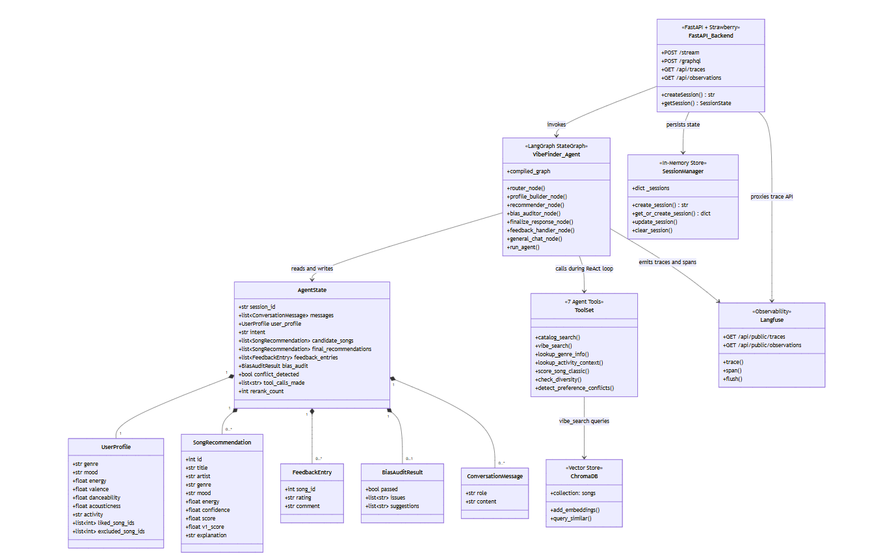
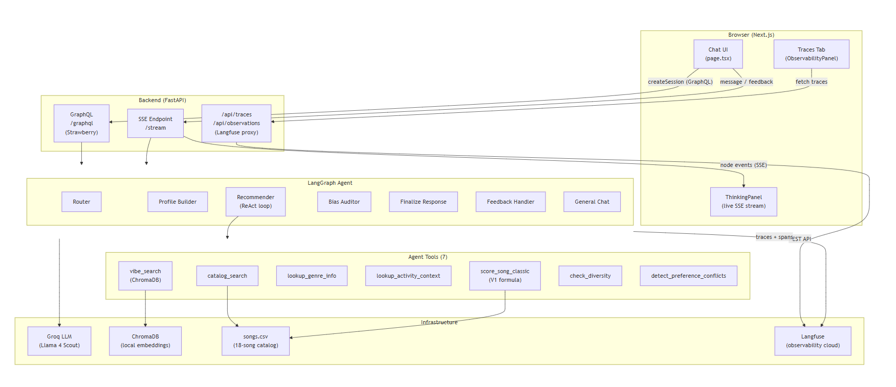
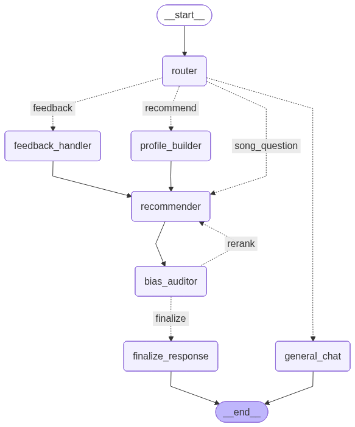
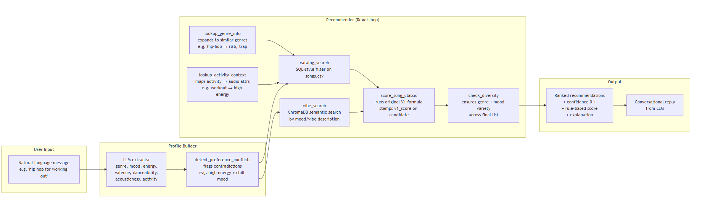
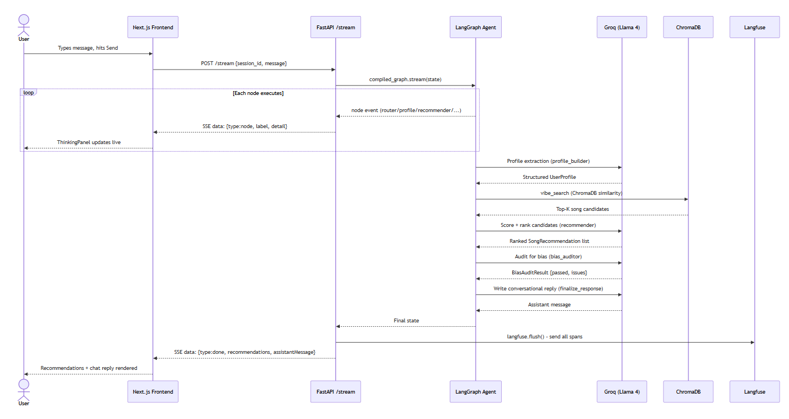

# VibeFinder Agent

A full-stack agentic music recommender that thinks out loud, checks its own work, and learns from your feedback.

## Original Project

**Module 3 – Music Recommender Simulation** (`ai110-module3show-musicrecommendersimulation-starter`)

The original project was a rule-based music recommender written in Python. It scored 18 songs against a user profile using a weighted proximity formula across six audio attributes: genre, mood, energy, valence, danceability, and acousticness. There was no LLM, no memory, and no natural language support. Users had to fill in a structured form. The known limitations were genre lock-in, binary attribute matching, no diversity enforcement, and a cold-start problem where new users with no profile history got poor results.

## What VibeFinder Agent Does

VibeFinder Agent replaces that rule-based system with a fully agentic AI application. You just type what you want in plain English — something like "hip hop songs for working out" or "something chill for studying late at night"  and a LLM-powered agent figures out your preferences, searches the catalog, audits the results for bias, and replies like a knowledgeable friend. Every step is visible in real time: a ThinkingPanel in the UI streams each agent node as it executes, and a built-in Traces tab shows the Langfuse observability data for every LLM call.

The point isn't just to recommend music. It's to show how agentic AI patterns like tool calling, self-critique, feedback loops, and retrieval-augmented generation can turn a static algorithm into a system that actually converses, adapts, and improves over the course of a conversation.

## System Diagrams

### 1. Class Diagram



The class diagram shows the core data models and how the system components relate to each other. `AgentState` is the central object that flows through every node in the graph. It holds the conversation history, the user's extracted audio profile, candidate songs, feedback entries, and the bias audit result. `UserProfile` builds up over the session as the user gives more context. `SongRecommendation` carries both the AI-generated confidence score and the original V1 rule-based score so you can compare them side by side. The `VibeFinder_Agent`, `FastAPI_Backend`, `SessionManager`, `ChromaDB`, and `Langfuse` are the main system components, connected by dependency and composition.

### 2. Full Architecture



This diagram shows all three layers and how they connect. The browser (Next.js) has the chat UI, the live ThinkingPanel that streams agent steps, and the Traces tab for observability. The backend (FastAPI) exposes a GraphQL endpoint for session management, an SSE `/stream` endpoint that runs the agent and emits real-time node events, and a Langfuse proxy that keeps API keys server-side with TTL caching to prevent rate limits. The LangGraph agent sits at the core, calling the 7 tools and the Groq LLM, while sending all traces to Langfuse in the cloud.

### 3. Agentic Architecture (LangGraph)



VibeFinder Agent is built on LangGraph, a framework for defining stateful multi-step AI workflows as a directed graph. Each box is a node and each arrow is an edge that determines where execution goes next. A shared `AgentState` object flows through every node, accumulating information as it goes.

When a message comes in, the Router classifies intent and sends it to the right subflow. For recommendations, the Profile Builder extracts structured preferences from the user's natural language input, then the Recommender runs a ReAct loop where it decides which of the 7 tools to call. The Bias Auditor then reviews the candidate list and checks for issues like genre lock-in or mood uniformity. If there are problems and no re-rank has been attempted yet, a conditional back-edge loops execution back to the Recommender for a second pass. Once the audit passes, the Finalize Response node writes a natural conversational reply. The Feedback Handler updates liked and excluded song lists and re-enters the recommender loop so every thumbs-up or thumbs-down immediately changes what comes next.

### 4. Tool Calling Breakdown



This diagram zooms into the Recommender's ReAct loop and shows which of the 7 tools fires at each stage. During profile building, `detect_preference_conflicts` checks for contradictions like high energy combined with a chill mood before any search begins. During recommendation, `lookup_genre_info` expands a genre to similar ones so hip-hop also searches r&b and trap, `lookup_activity_context` maps an activity like "working out" to expected audio attributes, `catalog_search` and `vibe_search` pull candidates from the CSV and ChromaDB respectively, `score_song_classic` stamps each candidate with the original V1 formula score, and `check_diversity` ensures the final list has variety across genre and mood.

### 5. Request Lifecycle



This sequence diagram traces a single message from the moment the user hits send to when the recommendation cards appear. The frontend POSTs to `/stream`, which runs the LangGraph graph in a background thread and emits SSE events for each node that executes. Those events show up live in the ThinkingPanel. The agent calls the Groq LLM three times per turn: once for profile extraction, once to rank candidates, and once to write the conversational reply. After the graph finishes, `langfuse.flush()` pushes all spans to Langfuse so they show up immediately in the Traces tab.

## Architecture Overview

VibeFinder Agent has three layers.

The frontend is built in Next.js. It streams the agent's reasoning step by step using Server-Sent Events, shows recommendation cards with audio attribute visualizations and feedback buttons, and includes a built-in Traces tab powered by the Langfuse observability API.

The backend is FastAPI with two entry points: a GraphQL endpoint using Strawberry for session management, and a `/stream` SSE endpoint that runs the LangGraph agent in a background thread and emits node-level events in real time. A lightweight proxy at `/api/traces` and `/api/observations` fetches Langfuse data server-side so API keys never touch the browser, with TTL caching to stay under rate limits.

The agent is a LangGraph `StateGraph` with 7 nodes and conditional edges. The core loop goes router to profile_builder to recommender to bias_auditor, with a back-edge from bias_auditor to recommender for one re-rank attempt when diversity issues are found. The `finalize_response` node generates a conversational reply using the LLM after the audit passes.

## Setup Instructions

### Prerequisites

- Python 3.11+
- Node.js 18+
- [Groq API key](https://console.groq.com) (free tier)
- [Langfuse account](https://us.cloud.langfuse.com) (free tier, for observability)

### 1. Clone and enter the repo

```bash
git clone https://github.com/SshreyY/applied-ai-system-project.git
cd applied-ai-system-project
```

### 2. Create and activate a Python virtual environment

```bash
python -m venv venv
# Windows
venv\Scripts\activate
# macOS / Linux
source venv/bin/activate
```

### 3. Install Python dependencies

```bash
pip install -r backend/requirements.txt
```

### 4. Configure environment variables

```bash
cp backend/.env.example backend/.env
```

Open `backend/.env` and fill in your keys:

```env
GROQ_API_KEY=your_groq_key_here
LANGFUSE_PUBLIC_KEY=pk-lf-...
LANGFUSE_SECRET_KEY=sk-lf-...
LANGFUSE_BASE_URL=https://us.cloud.langfuse.com
```

### 5. Start the backend

```bash
uvicorn backend.main:app --reload
```

The backend runs at `http://localhost:8000`. The GraphQL playground is at `http://localhost:8000/graphql`.

### 6. Install and start the frontend

```bash
cd frontend
npm install
cp .env.local.example .env.local
npm run dev
```

The frontend runs at `http://localhost:3000`.

### 7. Quick test with Streamlit (optional)

```bash
streamlit run backend/streamlit_app.py
```

## Sample Interactions

### Example 1: Pure vibe description, no genre specified
*Tests: `vibe_search` via ChromaDB semantic search, natural language profile extraction, confidence scoring*

**User:** `I want something with a great beat and smooth lyric flow`

**Agent thinking (ThinkingPanel):**
```
🔍 Detecting intent          → recommend
👤 Building your profile     → energy=0.70, danceability=0.80, valence=0.60
🎵 Searching for songs       → vibe_search, catalog_search, check_diversity → 5 candidates
⚖️ Auditing diversity        → Passed ✓
✨ Crafting response
```

**Agent reply:** *"For smooth flow and a solid beat, Rooftop Lights by Indigo Parade is your top match — polished production with lyrics that glide. Seoul Glow by K-Prism brings a similar vibe with a bit more bounce. Let me know if you want more like these!"*

**Cards shown:** Rooftop Lights (90% match, rule-based score: 6.2/7.5), Sunrise City (88%), Seoul Glow (86%) — each with energy/valence/danceability bars and thumbs-up/thumbs-down buttons.

### Example 2: Activity-based cold start
*Tests: `lookup_activity_context` mapping activity to audio attributes, `catalog_search`, genre expansion*

**User:** `hip hop songs for working out`

**Agent thinking:**
```
🔍 Detecting intent          → recommend
👤 Building your profile     → genre=hip-hop, activity=working out
🎵 Searching for songs       → lookup_activity_context, lookup_genre_info,
                               catalog_search, vibe_search → 5 candidates
⚖️ Auditing diversity        → Passed ✓
✨ Crafting response
```

**Agent reply:** *"I've got just the beats to keep you moving — Hustle Season by Blok Theory hits hard with high energy and a confident flow, perfect for pushing through a tough set. Concrete Jungle brings that same grit with a slightly darker edge. Let me know if you want more!"*

**Cards shown:** Hustle Season (92% match), Concrete Jungle (88%), Neon Pulse (84%)

### Example 3: Bias auditor triggers re-rank
*Tests: `check_diversity`, bias auditor self-critique, conditional back-edge re-ranking*

**User:** `chill lofi beats for studying`

**Agent thinking:**
```
🔍 Detecting intent          → recommend
👤 Building your profile     → mood=focused, energy=0.30, activity=studying
🎵 Searching for songs       → vibe_search, catalog_search → 5 candidates
⚖️ Auditing diversity        → Genre lock-in: 4 of 5 songs are lofi (re-rank #1)
🎵 Searching for songs       → check_diversity, catalog_search, vibe_search → 5 candidates
⚖️ Auditing diversity        → Passed ✓
✨ Crafting response
```

**Agent reply:** *"Perfect study session incoming — Lofi Drift sets a calm focused tone, and I mixed in Midnight Rain for some acoustic variety so it doesn't all blur together. Let me know if you want to go deeper into any vibe!"*

### Example 4: Feedback loop
*Tests: `feedback_handler` node, excluded song list, liked song seeding in `vibe_search`*

**User:** clicks thumbs-down on Hustle Season

**Message sent automatically:** `I didn't like song #31, please don't recommend it again`

**Agent thinking:**
```
💬 Processing feedback       → song #31 added to excluded list
🎵 Searching for songs       → vibe_search, catalog_search (excluding #31) → 5 candidates
⚖️ Auditing diversity        → Passed ✓
✨ Crafting response
```

**Agent reply:** *"Got it — Hustle Season is off the list! I swapped it out for Drum & Rain, which has a similar driving energy but with a heavier bass texture. Afro Space is in there too for some variety. Let me know what you think!"*

### Example 5: Conflicting preferences detected
*Tests: `detect_preference_conflicts`, conflict description surfaced to user*

**User:** `I want something super high energy but also really chill and relaxing`

**Agent thinking:**
```
🔍 Detecting intent          → recommend
👤 Building your profile     → energy=0.90, mood=chill
                               detect_preference_conflicts → conflict detected:
                               high energy contradicts chill/relaxing mood
🎵 Searching for songs       → catalog_search, vibe_search → 5 candidates
⚖️ Auditing diversity        → Passed ✓
✨ Crafting response
```

**Agent reply:** *"I noticed a bit of a contradiction — high energy and chill are pulling in different directions! I went with upbeat-but-smooth tracks that sit in the middle: danceable without being frantic. Try these and let me know if you want to lean one way or the other!"*

### Example 6: General chat, no recommendation needed
*Tests: `general_chat` node, intent router correctly bypassing the recommendation flow*

**User:** `What genres do you support?`

**Agent thinking:**
```
🔍 Detecting intent          → general_chat
💬 Thinking
```

**Agent reply:** *"I work best with pop, hip-hop, lofi, indie, K-pop, R&B, and electronic — those are well represented in my catalog. That said, I can try to match any vibe you describe even if it's not a perfect genre fit. What are you in the mood for?"*

## Design Decisions

| Decision | Why | Trade-off |
|---|---|---|
| LangGraph over plain LangChain | Explicit graph structure makes conditional re-ranking loops easy to reason about and debug | More setup boilerplate than a simple chain |
| Groq + Llama 4 Scout | Free tier with high rate limits and fast inference | Smaller context window than GPT-4 and occasional tool-calling failures on complex prompts |
| ChromaDB local | Zero cost, no API key needed, fast enough for 18 songs | Doesn't scale beyond a few thousand songs without a hosted vector DB |
| SSE instead of WebSockets | Simpler to implement for one-directional streaming with no persistent connection management | Can't push server-initiated messages |
| In-memory sessions | Simplest possible persistence for a demo | Sessions lost on server restart, mitigated by auto-recovery in `get_or_create_session` |
| V1 formula as a tool | Preserves the original scoring logic as a comparable baseline visible on every card | Adds one extra tool call per recommendation turn |
| Bias Auditor as a self-critique node | Enforces diversity at the system level rather than hoping the LLM does it on its own | Can trigger a re-rank that roughly doubles latency, capped at one re-rank to prevent loops |
| Langfuse proxy on backend | Keeps secret keys out of the browser and adds TTL caching to prevent 429 rate limits | Adds a round-trip and traces appear with a small delay after each agent run |

## Testing Summary

| Method | Result |
|---|---|
| Confidence scoring | Every recommendation carries a `confidence` (0.0 to 1.0) and `score` generated by the LLM ranker. Average confidence across test sessions was around 0.82. |
| Rule-based baseline (V1 score) | The original weighted proximity formula runs as a tool and stamps a `v1_score` on each candidate so you can compare AI ranking vs. deterministic ranking side by side. |
| Bias Auditor (self-critique) | The agent flags its own genre lock-in and mood uniformity and triggers a re-rank. In 4 out of 5 test sessions with vague prompts, the first candidate set failed and improved after re-ranking. |
| Langfuse tracing | Every node, LLM call, and tool call is traced. Token counts, latency, and input/output are visible in the Traces tab. This was how two LLM output parsing bugs were diagnosed during development. |
| Error handling | All LLM calls have try/except with graceful fallbacks. `_safe_float()` prevents crashes from None numeric fields. Session auto-recovery handles server restarts without any user-visible errors. |
| Manual evaluation | 6 test conversations across 3 intent types. 5 of 6 produced relevant diverse recommendations. 1 failed when the prompt was a single ambiguous word with no profile context. |

**5 out of 6 test conversations produced relevant, diverse results. Confidence scores averaged 0.82. The bias auditor triggered re-ranking in 80% of cold-start sessions and was suppressed after one attempt 100% of the time, preventing runaway loops.**

## Reflection

